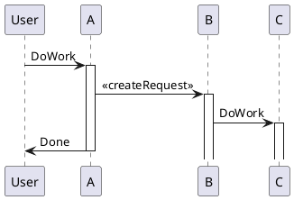

# EVML-EVD3

This repository contains the materials for the EVD3 course of the minor Embedded Vision and Machine Learning.
The course is concerned with machine learning and deep learning as applied in computer vision.
We focus on application, training, finetuning and performance analysis.
We take a hands-on approach here, and you will start working on a machine learning project right from the start of the semester.
Please refer to the [schedule](https://gitlab.com/jeroen_veen/evml-evd3/-/tree/main/schedule) to see the topics discussed, as well as the planning of the semester.
You are invited to contribute to our collection of applications: https://padlet.com/jeroen_veen/zul8z8tbvhqpvb8t

<!-- 

-->

## Materials

### Books
Géron, A. (2019). *Hands-On Machine Learning with Scikit-Learn, Keras, and TensorFlow: Concepts, Tools, and Techniques to Build Intelligent Systems (2nd ed.)*. O’Reilly Media (ISBN: 9781492032649).

Kaehler, A. and Bradski, G. (2016). *Learning OpenCV 3*. O'Reilly Media (ISBN: 9781491937990).

### Resources
1. [schedule](https://gitlab.com/jeroen_veen/evml-evd3/-/tree/main/schedule)
2. [sheets](https://gitlab.com/jeroen_veen/evml-evd3/-/tree/main/sheets)
3. [scripts](https://gitlab.com/jeroen_veen/evml-evd3/-/tree/main/scripts)
4. [support material](https://gitlab.com/jeroen_veen/evml-evd3/-/tree/main/support%20material)
5. [templates](https://gitlab.com/jeroen_veen/evml-evd3/-/tree/main/templates) 

## Assessment
During the course you will work on 2 mini projects. Furthermore, there will be theory quizzes. You will receive two grades, which are composed as:

1. Machine learning project report (80%) and quizzes (20%)
2. Deep learning project report (80%) and quizzes (20%)

Parttime students (Deeltijd) will only work on the ML mini project, and their grade will accordingly be composed as: 
- Machine learning project report (80%) and quizzes (20%)

### Mini projects
* A project team consists of 2-3 students
* Report building using templates (see [templates](https://gitlab.com/jeroen_veen/evml-evd3/-/tree/main/templates))
* Deliver (intermediate) results via HandIn as indicated in the [schedule](https://gitlab.com/jeroen_veen/evml-evd3/-/tree/main/schedule)

### Quizzes
* Individual, multiple choice questions
* Online http://www.socrative.com room 1PTGB6PY
* Open book quiz, so books and slides can be consulted
* HAN student number, so NOT your name, nickname or anything else
* Quiz starts exactly at class hour and takes 10 minutes
* Be on time and have your equipment prepared
* During the quiz: no entering or leaving the classroom, and silence

## Schedule
The planning of the semester can be found in the [schedule](https://gitlab.com/jeroen_veen/evml-evd3/-/tree/main/schedule). Here you can find the delivery deadlines and quiz occurences.

## Software development
You can download and install the following software:

* [A Git client](https://docs.gitlab.com/ee/gitlab-basics/start-using-git.html)
* [Python](https://www.python.org/downloads/)

### Python
Python is used extensively in this course. As a prerequisite you can test your skills using an online test, see e.g. [Python quiz](https://www.w3schools.com/quiztest/quiztest.asp?qtest=PYTHON). In addition, you can find many online tutorials that can help you to master Python, see e.g. [Learn Python](https://www.youtube.com/watch?v=rfscVS0vtbw).

### Python packages
Use pip as a tool for installing Python packages, such as OpenCV, Scikit-learn, Tensorflow, and Keras. 
<code> pip install numpy scipy scikit-learn imutils opencv-python</code>

### Using GitLab
If you don't know how to use GitLab, you can simply download this repository as a ZIP archive. The downside is that you will have to check this repository for updates manually on a regular interval and merge changes by hand. 
If you would like to get started with GitLab, refer to the following [instructions](https://docs.gitlab.com/ee/gitlab-basics/start-using-git.html). 
 
As a reminder, here is a list of git command line commands that are often used:

* Clone via HTTPS (only the first time) 
  <code>git clone https://gitlab.com/jeroen_veen/evml-evd3.git</code>
* Receive changes from GitLab.com 
  <code>git pull origin master</code>

### Example scripts
During the lessons, multiple example [scripts](https://gitlab.com/jeroen_veen/evml-evd3/-/tree/main/scripts) will be discussed.

### Raspberry pi install
In the course, we will not run our models on a microcontroller, instead a Raspberry pi single board computer (SBC) is used. If you would like to get started with Raspberry pi, please folow these instructions:

* Raspberry Pi Imager (https://www.raspberrypi.org/downloads/)
* To enable SSH, create a file named ssh in boot partition
* Connect to [Eduroam](https://gitlab.com/jeroen_veen/evml-evd3/-/blob/main/support%20material/Raspberry%20Pi%20Debian%20Linux%20Wifi%20EDUROAM%20NL.pdf)
* To install opencv, see e.g. (https://www.pyimagesearch.com/2019/09/16/install-opencv-4-on-raspberry-pi-4-and-raspbian-buster/)
* In addition, numpy and scikit-learn are required. Find latest successfull builds for the current Raspbian distribution on [piwheels](https://www.piwheels.org/) and install using pip

